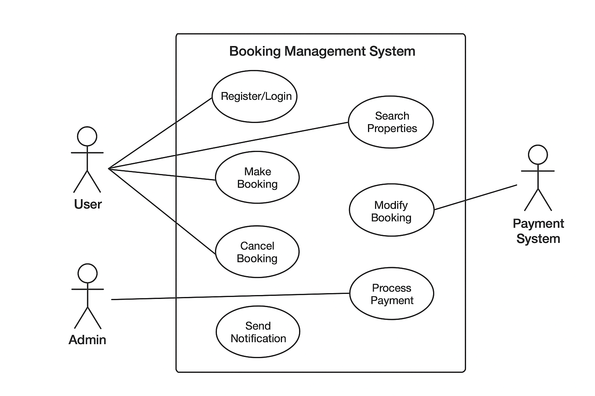

# requirement-analysis
# Requirement Analysis in Software Development

This repository documents the Requirement Analysis Project for a booking management system. 

The purpose of this repository is to provide a clear, structured foundation for software development by documenting, analyzing, and structuring both functional and non-functional requirements, creating use cases, acceptance criteria, and visual diagrams to ensure alignment with business and user goals.
## What is Requirement Analysis?

Requirement Analysis is the process of identifying, gathering, documenting, and analyzing the needs and expectations of stakeholders for a software system. It serves as the foundation for designing and developing software that aligns with business goals and user requirements.

In the Software Development Lifecycle (SDLC), Requirement Analysis plays a critical role by:

- **Clarifying project scope:** It defines what the system should and shouldn’t do, helping prevent scope creep.
- **Identifying functional requirements:** Specifies the features and functions the system must provide.
- **Identifying non-functional requirements:** Defines performance, security, usability, and reliability standards.
- **Establishing acceptance criteria:** Sets conditions that must be met for stakeholders to accept the final product.
- **Supporting design and development:** Provides a clear blueprint for developers, testers, and project managers.
- **Reducing risks:** Ensures miscommunication or misunderstanding of requirements is minimized, saving time and cost.

By thoroughly performing Requirement Analysis, teams can ensure a structured, efficient, and successful software development process.
## Why is Requirement Analysis Important?

Requirement Analysis is a vital phase in the Software Development Lifecycle (SDLC) because it ensures that the software developed meets stakeholder expectations and business goals. Key reasons for its importance include:

1. **Clarifies Project Scope:**  
   Requirement Analysis defines what the system should and shouldn’t do, helping prevent scope creep and misunderstandings during development.

2. **Reduces Development Risks:**  
   By identifying and documenting requirements early, potential issues, miscommunications, and gaps are minimized, saving time and cost during later stages.

3. **Guides Design and Implementation:**  
   Well-analyzed requirements provide a clear blueprint for developers, testers, and project managers, ensuring the system is built correctly the first time.

4. **Enhances Stakeholder Satisfaction:**  
   With clear acceptance criteria and documented requirements, stakeholders can validate that the software meets their needs, increasing trust and satisfaction.

5. **Supports Testing and Quality Assurance:**  
   Accurate requirements allow testers to create meaningful test cases and validate that the system behaves as expected.

## Key Activities in Requirement Analysis

Requirement Analysis involves several key activities that ensure a comprehensive understanding of stakeholder needs. These activities include:

- **Requirement Gathering:**  
  Collecting information from stakeholders, users, and other sources to understand what the system must achieve.

- **Requirement Elicitation:**  
  Engaging stakeholders through interviews, surveys, workshops, and brainstorming sessions to uncover implicit needs and expectations.

- **Requirement Documentation:**  
  Recording the gathered requirements in a clear, structured format such as requirement specification documents, use cases, and user stories.

- **Requirement Analysis and Modeling:**  
  Refining and structuring the requirements to identify dependencies, priorities, and relationships. This often includes creating diagrams like use case diagrams or data flow diagrams.

- **Requirement Validation:**  
  Reviewing and confirming requirements with stakeholders to ensure accuracy, completeness, and feasibility before development begins.
  ## Types of Requirements

### Functional Requirements
Functional requirements describe what the system should do — the specific features and functionalities that the software must provide.

**Examples for the Booking Management System:**
- User registration and login
- Search and filter properties
- Make, modify, or cancel bookings
- Payment processing and confirmation
- Email notifications for booking updates

---

### Non-functional Requirements
Non-functional requirements describe how the system should perform. They focus on system quality, performance, and constraints rather than specific behaviors.

**Examples for the Booking Management System:**
- Page load time under 2 seconds
- System availability: 99.9% uptime
- Data security and encryption of sensitive information
- Scalability to support thousands of concurrent users
- Compliance with GDPR and local data protection regulations
  ## Use Case Diagrams

**What are Use Case Diagrams?**  
Use Case Diagrams are visual representations of the interactions between users (actors) and a system. They help illustrate functional requirements, clarify system boundaries, and communicate how different actors interact with various use cases.

**Benefits of Use Case Diagrams:**
- Provide a clear overview of system functionality
- Help identify all actors and their interactions
- Support requirement validation and communication with stakeholders
- Aid in designing test cases based on user interactions

**Use Case Diagram for Booking Management System:**

## Acceptance Criteria

### Importance of Acceptance Criteria
Acceptance Criteria (AC) are a set of conditions that a software product must satisfy to be accepted by a user, customer, or other stakeholders. They play a critical role in Requirement Analysis as they:

- Provide clear, measurable goals for development teams.
- Reduce misunderstandings between stakeholders and developers.
- Serve as the basis for testing and validation.
- Ensure that the delivered feature meets the intended requirements.

Well-defined acceptance criteria help teams focus on what "done" looks like for a feature, avoiding scope creep and ambiguous expectations.

### Example: Checkout Feature in a Booking Management System
For a Checkout feature in a booking management system, the acceptance criteria could be defined as follows:

1. **User Authentication**
   - Users must be logged in to complete the checkout.
   - If the user is not logged in, the system should prompt them to log in or register.

2. **Booking Summary**
   - The checkout page must display a summary of the selected booking items including date, time, quantity, and total price.

3. **Payment Processing**
   - Users must be able to select a payment method (Credit Card, PayPal, Mobile Payment).
   - Payment processing should be secure and confirm transaction success before completing the booking.

4. **Confirmation**
   - After a successful payment, users must receive a confirmation message on the screen and a confirmation email with booking details.
   - The system should update the booking status to "Confirmed" in the database.

5. **Error Handling**
   - If payment fails, users should be notified with an appropriate error message.
   - Users must be able to retry payment without losing booking information.

By defining these criteria clearly, the development and QA teams can ensure that the Checkout feature functions as expected and meets stakeholder expectations.

